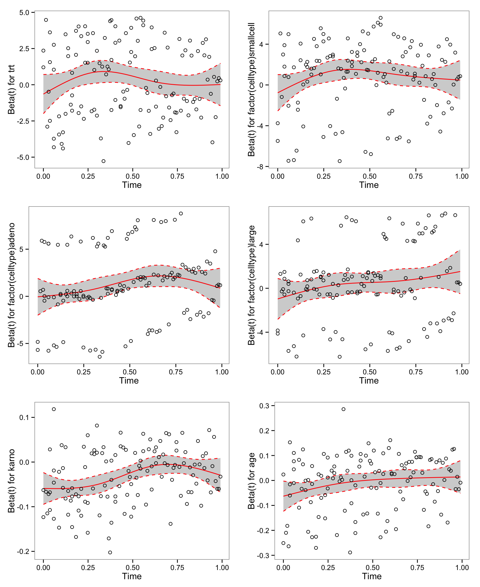
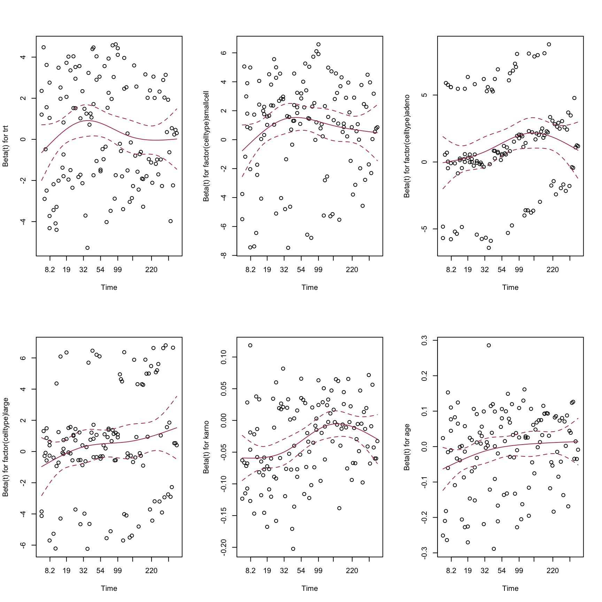

<!-- README.md is generated from README.Rmd. Please edit that file -->
gghazard : Improved Base and Grid Plots for Survival Hazard Cox Regression

The following functions are implemented:

-   `fortify.cox.zph`: Create data structures from survival hazard Cox Regression
-   `gg_cox_zph`: Graphical Test of Proportional Hazards (ggplot2/grid)
-   `plot.cox.zph`: Graphical Test of Proportional Hazards (base)

### News

-   Version 0.0.0.9000 released

### Installation

``` r
devtools::install_github("hrbrmstr/gghazard")
```

### Usage

``` r
library(survival)
library(ggplot2)
library(gghazard)
#> Loading required package: gridExtra

# current verison
packageVersion("gghazard")
#> [1] '0.0.0.9000'

vfit <- coxph(Surv(time, status) ~ trt + factor(celltype) +
              karno + age, data=veteran, x=TRUE)
```

``` r
gg_cox_zph(fortify(cox.zph(vfit)), pred_col="maroon")
```



``` r
par(mfrow=c(2, 3))
plot(cox.zph(vfit), smoothcol="maroon", confcol="maroon")
```



``` r
par(mfrow=c(1, 1))
```

### Test Results

``` r
library(gghazard)
library(testthat)

date()
#> [1] "Mon Aug 31 06:40:09 2015"

test_dir("tests/")
#> testthat results ========================================================================================================
#> OK: 0 SKIPPED: 0 FAILED: 0
#> 
#> DONE
```

### Code of Conduct

Please note that this project is released with a [Contributor Code of Conduct](CONDUCT.md). By participating in this project you agree to abide by its terms.
